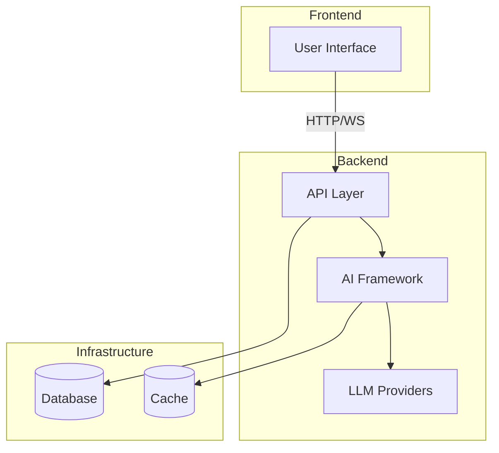

# AI-SDK-LANGCHAIN

[](https://github.com/mk-knight23/AI-SDK-ECOSYSTEM)
[](https://github.com/langchain-ai/langchain)
[](https://nextjs.org/)
[](https://www.python.org/)

> **Framework**: LangGraph (Stateful Multi-Agent Applications)
> **Stack**: Next.js 15 + FastAPI + PostgreSQL + Redis

---

## 🎯 Project Overview

**AI-SDK-LANGCHAIN** is a production-ready SaaS application showcasing stateful multi-agent systems using LangGraph. It demonstrates cyclic graph topology, checkpointing, and human-in-the-loop approval patterns for building complex AI workflows.

### Key Features

- 🔄 **Stateful Agent Workflows** - LangGraph cyclic graphs with persistent state
- 🧠 **Multi-Provider LLM Support** - OpenAI, Anthropic, OpenRouter, Perplexity
- 📊 **Real-time Streaming** - WebSocket-based agent execution monitoring
- 🔐 **Human-in-the-Loop** - Approval gates for critical decisions
- 📈 **Production Ready** - Full CI/CD, 80%+ test coverage, Docker deployment

---

## 🛠 Tech Stack

### Frontend
| Technology | Version | Purpose |
|-------------|---------|---------|
| Next.js | 15 | React framework with RSC |
| React | 19 | UI library |
| Tailwind CSS | v4 | Styling |
| shadcn/ui | latest | Component library |
| TypeScript | 5.x | Type safety |

### Backend
| Technology | Version | Purpose |
|-------------|---------|---------|
| Python | 3.12 | Runtime |
| FastAPI | latest | API framework |
| LangGraph | latest | Agent orchestration |
| LangSmith | - | Tracing & debugging |
| PostgreSQL | 16 | State persistence |
| Redis | 7.x | Caching |

---

## 🚀 Quick Start

### Prerequisites
- Node.js 18+
- Python 3.12+
- Docker (optional)

### Frontend Setup

```bash
cd frontend
npm install
npm run dev
```

Visit `http://localhost:3000`

### Backend Setup

```bash
cd backend
pip install -r requirements.txt
uvicorn main:app --reload
```

API runs at `http://localhost:8000`

### With Docker

```bash
docker-compose up
```

---

## 🔌 API Integrations

| Provider | Usage | Environment Variable |
|----------|-------|---------------------|
| OpenAI | Primary LLM | `OPENAI_API_KEY` |
| Anthropic | Claude fallback | `ANTHROPIC_API_KEY` |
| OpenRouter | Multi-model router | `OPENROUTER_API_KEY` |
| Perplexity | Search augmentation | `PERPLEXITY_API_KEY` |

---

## 📦 Deployment

### Railway (Backend)

```bash
cd backend
railway up
```

### Vercel (Frontend)

```bash
cd frontend
vercel deploy
```

### Environment Variables

Set these in your deployment platform:

```
ANTHROPIC_API_KEY=your_key_here
OPENAI_API_KEY=your_key_here
OPENROUTER_API_KEY=your_key_here
PERPLEXITY_API_KEY=your_key_here
DATABASE_URL=your_postgres_url
REDIS_URL=your_redis_url
```

---

## 📁 Project Structure

```
AI-SDK-LANGCHAIN/
├── frontend/           # Next.js 15 application
│   ├── app/            # React Server Components
│   ├── components/     # Reusable UI components
│   └── lib/            # Utilities
├── backend/            # FastAPI application
│   ├── agents/         # LangGraph agent definitions
│   ├── graphs/         # Workflow graphs
│   ├── api/            # API endpoints
│   └── tests/          # TDD test suites
├── docker-compose.yml
├── Dockerfile
└── README.md
```

---

## 🧪 Testing

```bash
# Backend tests
cd backend
pytest --cov=app --cov-report=html

# Frontend tests
cd frontend
npm test
```

Target: **80%+ coverage**

---

## 📝 Development Workflow

This project follows the **5-Ecosystem** methodology:

1. **Superpowers** - Brainstorming → Planning → TDD
2. **ECC** - `/plan` → `/tdd` → `/code-review` → `/security-scan`
3. **UI/UX Pro Max** - Design system application
4. **Ralph Loop** - Autonomous development iterations
5. **Claude-Tips** - DX optimization

---

## 🤝 Contributing

1. Fork the repository
2. Create a feature branch (`git checkout -b feature/amazing-feature`)
3. Follow TDD: write tests FIRST, then implement
4. Ensure 80%+ test coverage
5. Submit a pull request

---


---

## 🏗️ Architecture



---

## 📡 API Endpoints

| Method | Endpoint | Description |
|--------|----------|-------------|
| GET | /health | Health check |
| POST | /api/execute | Execute agent workflow |
| WS | /api/stream | WebSocket streaming |

---

## 🔧 Troubleshooting

### Common Issues

**Connection refused**
- Ensure backend is running
- Check port availability

**Authentication failures**
- Verify API keys in `.env`
- Check environment variables

**Rate limiting**
- Implement exponential backoff
- Reduce request frequency

---

## 📚 Additional Documentation

- [API Reference](docs/API.md) - Complete API documentation
- [Deployment Guide](docs/DEPLOYMENT.md) - Platform-specific deployment
- [Testing Guide](docs/TESTING.md) - Testing strategies and coverage

## 📄 License

MIT License - see [LICENSE](LICENSE) for details.

---

## 🔗 Links

- [Showcase Ecosystem](https://github.com/mk-knight23/AI-SDK-ECOSYSTEM)
- [Live Demo](#) (coming soon)
- [Documentation](#) (coming soon)

---

**Built with ❤️ as part of the [AI-SDK Ecosystem](https://github.com/mk-knight23/AI-SDK-ECOSYSTEM)**
